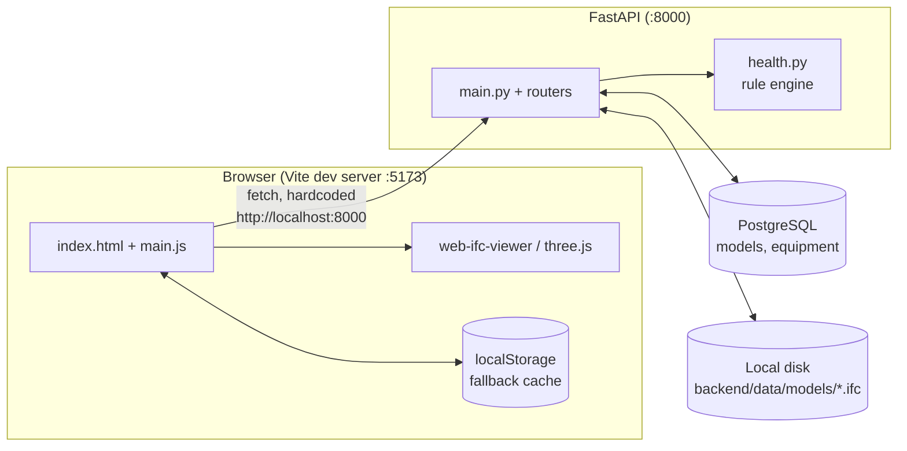

# 00 — Existing Codebase Analysis & Platform Fit

**Repo:** `DurianOS` (working title, current remote-less local repo)
**Purpose of this document:** Inventory what already exists in this repository, and map it against the target **FruitTwin AI – Enterprise Orchard Digital Twin & AI Farm Management Platform** so later SDLC phases (Vision, Scope, BRD/SRS, Architecture, ...) start from ground truth instead of assumption.

Status: current repo = **1 commit**, no `/docs`, no tests, no CI, no auth, no multi-tenancy. This is a **single-user, single-farm proof-of-concept**, not yet enterprise-grade. That's fine — it's a legitimate starting seed for two specific target modules (see §4).

---

## 1. What exists today

### 1.1 Frontend — `apps/web`-equivalent (currently repo root `src/` + `index.html`)

| File | Role |
|---|---|
| [index.html](../index.html) | Single-page shell: viewer canvas, side panels (spatial tree, properties, equipment/tree library, dashboard overlay), drop zone |
| [src/main.js](../src/main.js) | All application logic (~1650 lines, no framework): IFC loading, 3D interaction, equipment/tree placement, forms, dashboard rendering |
| [src/api.js](../src/api.js) | Thin `fetch` wrapper for the FastAPI backend, hardcoded to `http://localhost:8000` |
| [src/equipment.js](../src/equipment.js) | Equipment type catalog (10 types) + procedural Three.js primitive geometry + floating label sprites |
| [src/trees.js](../src/trees.js) | Fruit tree type catalog (10 species) + procedural Three.js canopy/trunk/palm/banana geometry |
| [src/style.css](../src/style.css) | Dark-theme UI styling |

**Stack:** Vite, vanilla JS (no TypeScript, no framework), `three` `^0.135`, `web-ifc` + `web-ifc-viewer` `^1.0.218`.

**Capabilities actually working today:**
- Load `.ifc` files (drag-drop or file picker), render in 3D via `web-ifc-viewer`, fit-to-view, axes/grid.
- Spatial structure tree (collapsible, click-to-select-and-highlight).
- IFC element property inspector (GlobalId, Psets, quantities) on click.
- "Equipment" library of 10 generic industrial asset types (pump, motor, valve, tank, conveyor, sensor, fan, compressor, generator, panel) — each a hand-built low-poly Three.js shape, no real IFC/GLTF asset.
- "Tree" library of 10 fruit species (mango, **durian**, longan, rambutan, mangosteen, lime, pomelo, papaya, banana, coconut) — same procedural-geometry approach.
- Click-to-arm-and-place or drag-and-drop placement of equipment/trees into the 3D scene, raycast onto the loaded IFC model or a ground plane.
- Per-instance property form: name, position (x/y/z), rotation, scale, notes, **condition data** (status enum, last maintenance date, operating hours, temperature °C, vibration mm/s) — condition fields only shown for equipment, not trees.
- Drag-to-reposition placed objects directly in the 3D view; selection highlight (`BoxHelper`).
- "View" vs "Edit" mode toggle (read-only mode hides placement tabs and disables form inputs).
- Server-backed persistence when the FastAPI backend is reachable; **automatic fallback to `localStorage`** (keyed by model filename) when it isn't — a genuinely nice offline-degradation pattern already in place.
- JSON layout export/import (manual backup/restore, also re-imports through the server API if connected).
- A **fleet health "Dashboard" overlay**: stat tiles (total, avg score, good/warning/critical counts), a proportion bar, and a sortable table with a donut-chart score widget per item; clicking a row loads the right model and focuses the camera on that asset.
- Thai-language UI strings for backend-dependent messages and health output (`ต้องเชื่อมต่อ backend...`, recommendations, labels) — bilingual intent already present.

### 1.2 Backend — `services/`-equivalent (currently repo root `backend/`)

FastAPI + SQLAlchemy 2.0 (typed `Mapped[...]` style) + PostgreSQL via `psycopg`.

| File | Role |
|---|---|
| [backend/app/main.py](../backend/app/main.py) | App factory, CORS, router registration, `Base.metadata.create_all` (no Alembic yet), `/api/status` |
| [backend/app/config.py](../backend/app/config.py) | `pydantic-settings`: `DATABASE_URL`, `CORS_ORIGINS`, `data_dir`, `.env`-driven |
| [backend/app/database.py](../backend/app/database.py) | Engine/session factory, `get_db()` dependency |
| [backend/app/models.py](../backend/app/models.py) | `ModelRecord` (uploaded IFC file), `Equipment` (placed instance — see §1.3) |
| [backend/app/schemas.py](../backend/app/schemas.py) | Pydantic I/O schemas (Create/Update/Out per entity, `HealthOut`, `DashboardSummary`) |
| [backend/app/health.py](../backend/app/health.py) | **Rule-based** condition-monitoring scoring engine (see below) |
| [backend/app/routers/models.py](../backend/app/routers/models.py) | `/api/models`: upload (`.ifc` only, saved to disk under `data/models/`), list, get, download file, delete (cascades equipment) |
| [backend/app/routers/equipment.py](../backend/app/routers/equipment.py) | `/api/equipment`: CRUD + `/{{id}}/health` |
| [backend/app/routers/dashboard.py](../backend/app/routers/dashboard.py) | `/api/dashboard/summary`: aggregates health across all non-tree equipment |

**Data model today (2 tables):**
- `models(id, name, file_path, uploaded_at)` — one row per uploaded IFC file, stored on local disk (no S3/MinIO abstraction).
- `equipment(id, model_id?, type, name, pos_x/y/z, rotation_y, scale, notes, status, install_date, last_maintenance_date, operating_hours, temperature_c, vibration_mm_s, created_at, updated_at)` — **one flat table for both "equipment" AND "trees"**, disambiguated only by a `type` string prefix convention (`tree_*`) checked in application code (`isTreeType()` in JS, `~type.like('tree_%')` in SQL). `model_id` nullable → equipment can exist unscoped (global/local-only layouts).

**Health scoring (`health.py`):** deterministic threshold table per equipment `type` (temp warn/crit °C, vibration warn/crit mm/s, maintenance interval days) → score out of 100, band (`good`/`warning`/`critical`), Thai-language recommendations. Explicitly commented as "indicative industrial defaults... not a certified standard." No ML, no time-series, no anomaly detection — this is a **static rules engine**, not the predictive-maintenance ML described in the target platform, but it is the right *shape* of output (score + band + evidence + recommendation) to later swap for a real model.

### 1.3 Data

- `PLAN_ARC.ifc` (14 MB, repo root) — a real architectural/plant IFC model, currently outside `backend/data/models/` (i.e. not through the upload pipeline).
- `data/models/f663c483-*.ifc` — one model already uploaded through the API.
- `backend/data/models/.gitkeep` — upload target directory, gitignored otherwise (correctly avoids committing binary IFC uploads).

### 1.4 Explicitly absent

No auth/IAM, no tenant/organization/farm/plot hierarchy, no GIS/map layer, no IoT/MQTT/sensor ingestion, no time-series store, no vision AI/CCTV, no irrigation/fertigation, no crop/growth-stage domain, no yield/harvest, no inventory/procurement, no accounting, no workflow/approval engine, no AI/ML model registry or copilot, no alerting, no audit trail, no tests, no CI/CD, no migrations (Alembic is not wired up despite being in `requirements.txt`... actually not even listed there — confirmed absent), no Docker/compose files, no `.env.example`.

---

## 2. As-is architecture

Single environment, single tenant, no edge tier, no message broker — everything is a direct synchronous REST call from a monolithic frontend script to a monolithic FastAPI app.

---

## 3. Fit against the target FruitTwin AI platform

Mapping current code to the master-prompt's module list (§6–§62 of the platform brief). Maturity: 🟢 usable seed · 🟡 partial/naïve · ⚪ not started.

| Target module | Current state | Notes |
|---|---|---|
| **§10 Digital Twin Core** (generic `DigitalTwin`/`TwinType`/`TwinRelationship`/`TwinTelemetry`...) | 🟡 | `Equipment` table is a flattened, single-type ancestor of a twin — has state + condition fields but no `TwinType` catalog, no graph/relationships, no telemetry history (only latest snapshot), no twin ID scheme (`FARM01-DUR-A-R03-T025`), no event timeline |
| **§8/§13 3D Digital Twin / GIS-3D** (IFC + 3D Tiles + point cloud viewer) | 🟢 | The IFC viewer itself (`web-ifc-viewer`, spatial tree, property inspector, click-to-select) is a solid, working seed for the IFC half of the hybrid spatial model. No GIS/MapLibre, no CesiumJS, no 3D Tiles, no point cloud, no terrain/orchard-scale rendering — those are net-new |
| **§10 Tree Digital Twin** | 🟡 | `trees.js` gives 10 species with placeholder geometry and a name/position/notes record — but none of Planting Date, Age, Health Score, Growth Stage, Flowering/Fruit-Set/Yield history, disease/irrigation/fertilization/harvest history exist. Today a "tree" is cosmetically different from "equipment" only by an id prefix |
| **§20 Asset & Machinery Management** | 🟡 | 10 equipment types with position + condition snapshot is a genuine seed for `Asset`, but no manufacturer/serial/warranty/spare-parts/documents, no asset hierarchy |
| **§21/§22 Maintenance / Predictive Maintenance** | 🟡 | `health.py`'s score/band/recommendation output shape matches the target's "Prediction → Recommendation → Approved Action" pattern conceptually, but it's static rule thresholds on a single latest reading, not RUL/anomaly-score ML over time-series signals. No `WorkOrder`, `MaintenanceRequest`, approval flow, or `AssetMeter` history |
| **§38 Executive Command Center / Dashboard** | 🟡 | The fleet dashboard (stat tiles, band distribution, sortable table, click-to-focus-in-3D) is a working, reusable **UI pattern** worth carrying forward, but it's fixed-layout (not drag-and-drop configurable) and only covers equipment health, not the full KPI set (weather, yield, finance, work orders...) |
| **§35/§36 Security / Audit** | ⚪ | No auth, no RBAC, no tenant isolation, no audit trail — required before any multi-user or multi-farm use |
| **§9 Crop Configuration Engine** | ⚪ | Tree "types" are a hardcoded array of 10 species with cosmetic-only attributes (canopy color, icon) — no `Crop`/`Variety`/`GrowthStage`/agronomic rule versioning |
| **§7 GIS & Map** | ⚪ | Nothing — no lat/long, no polygon farm boundary, no layer manager |
| **§11 IoT/Sensor platform** | ⚪ | `temperature_c`/`vibration_mm_s` are manually-typed form fields, not live telemetry — no device registry, MQTT, TimescaleDB, or ingestion pipeline |
| **§14 CCTV/Vision AI, §17 Yield, §18 Harvest, §23 Inventory, §24 Procurement, §25 Farm Accounting, §29/§30 AI Copilot/Agents, §31 Alerts, §33 Workflow/Approval** | ⚪ | Not started |

**Bottom line:** the repo is a credible, working seed for exactly two things in the target architecture — **(a) the IFC/3D digital-twin viewer** (`services/digital-twin` + the 3D-viewer part of `apps/web`) and **(b) a first-pass Asset/Equipment twin with a rule-based health score** (a placeholder for `services/ai` predictive maintenance until real ML lands). Everything else in the 60-section brief — farm/crop domain, GIS, IoT, vision AI, agronomy, finance, workflow, IAM/multi-tenancy — is greenfield.

---

## 4. Recommended repo-structure mapping (target layout per platform brief §51)

| Target path | Source today |
|---|---|
| `apps/web/` | repo-root `index.html`, `src/*`, `package.json` (needs migration off vanilla JS onto the target's Next.js/React/TypeScript stack — current code is **not** reusable line-for-line, but its interaction logic — raycasting placement, drag-to-move, selection highlight, IFC property panel, health dashboard — is a direct spec for the React components) |
| `services/digital-twin/` | `backend/app/models.py::Equipment` (as the seed for the twin state store), needs to be re-modeled onto generic `DigitalTwin`/`TwinType`/`TwinRelationship` entities |
| `services/ifc/` (or folded into digital-twin) | `web-ifc-viewer` integration in `main.js`, and IFC file storage/serving currently in `backend/app/routers/models.py` |
| `services/ai/` (predictive maintenance stub) | `backend/app/health.py` — keep the score/band/recommendation *contract* (it already matches §57's expected fields), replace the rule table with a real model behind the same interface later |
| `infrastructure/`, `docker/`, `migrations/` | **missing** — needs Dockerfiles, docker-compose (Postgres + backend + web), and Alembic migrations before this can be called Phase-3-ready |

---

## 5. Key risks / debt to resolve before building on top of this code

1. **No migrations** — `Base.metadata.create_all()` in `main.py` means schema changes require manual DB surgery or data loss. Alembic must land before more tables are added.
2. **`Equipment` conflates two domains** (industrial asset vs. living tree) via a string-prefix hack — this must split into proper `Asset` and `Tree`/`DigitalTwin` entities before agronomy fields (growth stage, yield, disease) are added, or the table will become unmanageable.
3. **Hardcoded `API_BASE = 'http://localhost:8000'`** in `api.js` — needs environment-driven config before any deployment beyond a dev laptop.
4. **No tenant/farm scoping anywhere** — `model_id` is the only scoping key today; multi-farm/multi-tenant requires a real `tenant_id`/`farm_id` on every table plus RLS or query-layer enforcement, which is a breaking schema change best done early rather than retrofitted.
5. **No auth** — anyone who can reach port 8000 can upload/delete models and equipment; must land before any non-localhost exposure.
6. **14 MB `PLAN_ARC.ifc` committed at repo root**, outside the managed upload flow — should move under the object-storage/data pipeline (or stay as a fixtures/sample-data asset, but intentionally, not incidentally).

---

## 6. Suggested next step

This document answers "what do we have and where does it fit" (the ask for this turn). The platform brief's own Phase 0 (Vision/Scope/BRD/SRS/personas/full requirement-ID catalog across all 20+ target modules) is a substantially larger deliverable — worth explicitly scoping before writing it, given its size. See the follow-up question in chat.
