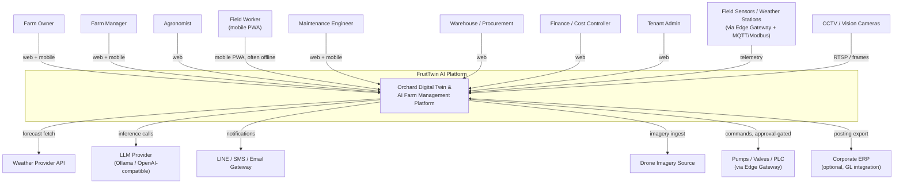
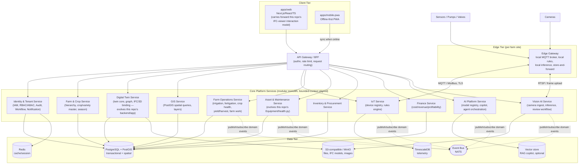
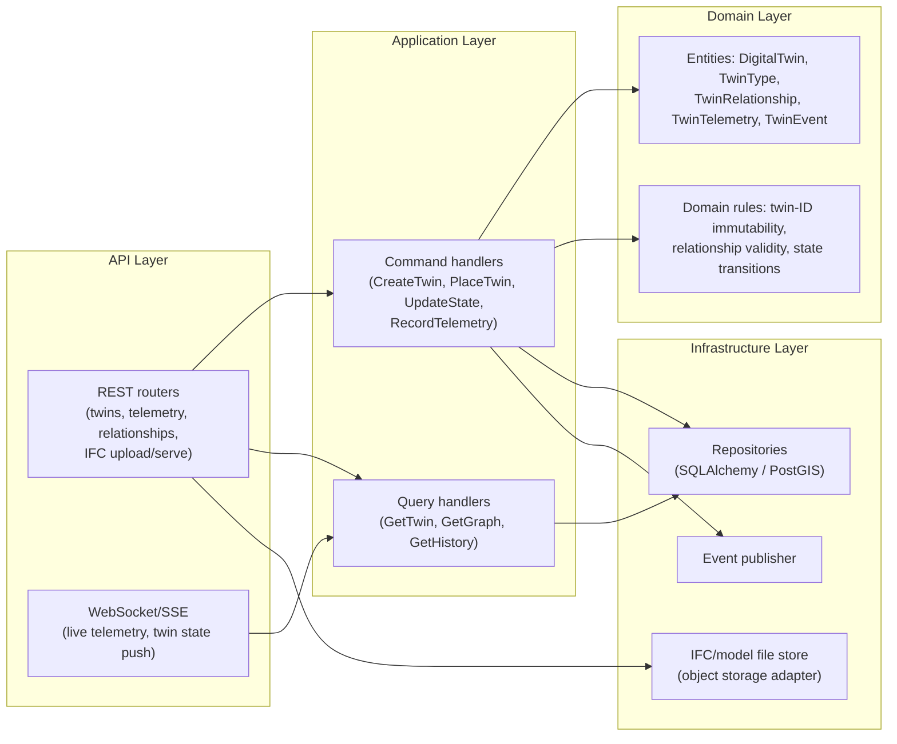
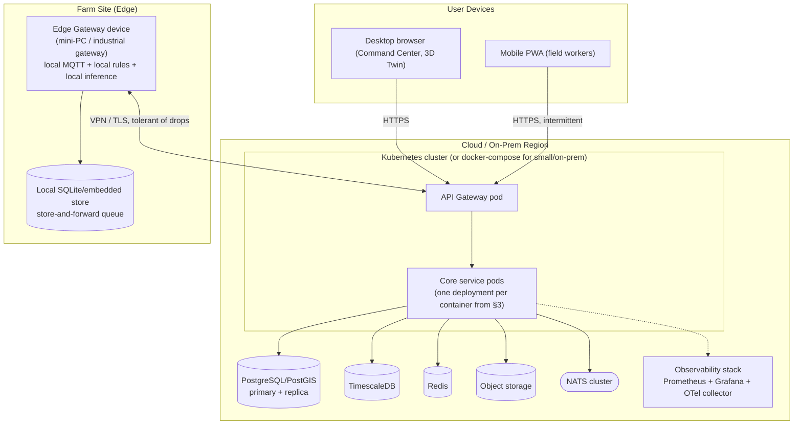

# 06 — Enterprise Architecture (Phase 1)

**Document status:** Draft for internal review · Phase 1 · v0.1
**Related:** [02-SCOPE.md](02-SCOPE.md) · [03-BRD.md](03-BRD.md) · [04-SRS.md](04-SRS.md) · [07-DOMAIN-MODEL.md](07-DOMAIN-MODEL.md) · [08-DATA-ARCHITECTURE.md](08-DATA-ARCHITECTURE.md) · [09-SECURITY-ARCHITECTURE.md](09-SECURITY-ARCHITECTURE.md) · [10-INTEGRATION-ARCHITECTURE.md](10-INTEGRATION-ARCHITECTURE.md) · [11-ADR.md](11-ADR.md)

No business-feature coding proceeds on top of this document until it — and its companion architecture documents — have been reviewed. This document uses the C4 model (Context → Container → Component → Code) for the structural views, per [02-SCOPE.md](02-SCOPE.md) and the requirements in [03-BRD.md](03-BRD.md)/[04-SRS.md](04-SRS.md).

---

## 1. Architecture principles

These constrain every decision below and every later phase; they are not aspirational.

1. **Domain-Driven Design** — bounded contexts (see [07-DOMAIN-MODEL.md](07-DOMAIN-MODEL.md)) own their own data; no context reaches directly into another's tables.
2. **Modular monolith first, microservice-ready boundaries** — Phase 3–9 ship as a small number of deployable services grouped by bounded-context cohesion (not one service per entity), each internally structured so it *could* be split later without a rewrite (Clean Architecture layering inside each service — see §4).
3. **API-first** — every capability is reachable via a documented OpenAPI contract before a UI consumes it (INT-001).
4. **Event-driven where state changes matter to other contexts** — synchronous REST for request/response, published domain events for cross-context reactions (INT-002).
5. **Configuration-driven business logic** — crop rules, thresholds, approval limits are tenant-configurable data, not code (FR-PLT-010, FR-FARM-003).
6. **Multi-tenant from the first schema** — every table carries `tenant_id`; isolation enforced at the data-access layer (SEC-003), decided in [ADR-007](11-ADR.md).
7. **Offline-capable edge** — field devices and mobile workers function disconnected and reconcile later (NFR-006); this is a first-class architectural concern, not a mobile-team afterthought.
8. **Zero Trust** — every request is authenticated and authorized server-side regardless of network origin (SEC-002); no implicit trust from being "inside" the network.
9. **RBAC + ABAC** — role grants a capability, scope (tenant/farm/plot) constrains where it applies (FR-PLT-004).
10. **Auditability by construction** — the audit trail is a platform service every write path calls through, not a per-feature afterthought (FR-PLT-007, BR-004).
11. **Observability by construction** — every service ships `/health`, `/ready`, `/metrics`, and structured logs from day one (NFR-005/009), not bolted on before go-live.
12. **i18n from the data model up** — user-facing strings (crop names, disease names, UI copy) are resolved through a localization layer for Thai/English, not hardcoded in either language (NFR-007).
13. **No cloud-provider lock-in** — infrastructure primitives (object storage, container runtime, secrets) are abstracted behind interfaces satisfiable by on-prem, any major cloud, or hybrid (per [02-SCOPE.md §2](02-SCOPE.md)).

## 2. C4 Level 1 — System Context

## 3. C4 Level 2 — Container Diagram

**Mapping to today's code:** `Digital Twin Service` and `Asset & Maintenance Service` are where this repo's existing FastAPI backend (`backend/app/`) and frontend (`src/`) land — see [00-EXISTING-CODEBASE-ANALYSIS.md §4](00-EXISTING-CODEBASE-ANALYSIS.md). Every other container in this diagram is new build.

## 4. C4 Level 3 — Component view (representative: Digital Twin Service)

Every core service follows the same Clean-Architecture layering; the Digital Twin Service is shown as the representative example since it's the one with existing code to evolve.

This layering is the **direct refactor target** for `backend/app/main.py` + `routers/*.py` + `models.py` + `health.py`, which today mix API, application, and data-access concerns in each router file. The Phase 3–6 implementation task is to introduce the Application/Domain layers, not to throw away the working router/model logic.

## 5. C4 Level 3 — Deployment Architecture

Small/single-orchard deployments (this repo's current use case) run the same container images via `docker-compose` on a single on-prem host instead of Kubernetes — DEP-002.

## 6. Bounded-context-to-container mapping

See [07-DOMAIN-MODEL.md](07-DOMAIN-MODEL.md) for the full bounded-context list; each maps 1:1 or many:1 onto the containers in §3 (e.g. Irrigation, Fertigation, Crop Health, Yield/Harvest, and Farm Work contexts all live in the single "Farm Operations Service" container initially — they are split into separate services only if/when independent scaling or team ownership requires it, per principle #2).
