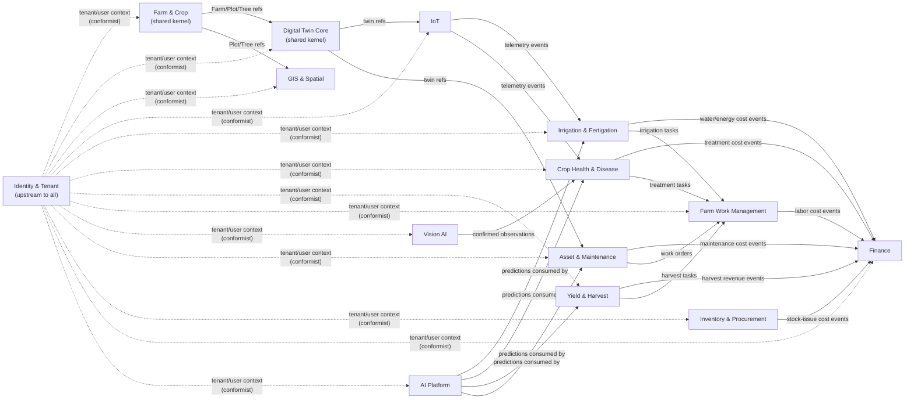

# 07 — Domain Model (Phase 1)

**Document status:** Draft for internal review · Phase 1 · v0.1
**Related:** [06-ARCHITECTURE.md](06-ARCHITECTURE.md) · [08-DATA-ARCHITECTURE.md](08-DATA-ARCHITECTURE.md)

Domain-Driven Design bounded contexts, their aggregates, and the context map. Each context owns its data; cross-context reads happen via API or subscribed events, never direct table access (architecture principle #1).

---

## 1. Bounded contexts

| Context | Owns | Key aggregates | Container (from [06-ARCHITECTURE.md §3](06-ARCHITECTURE.md)) |
|---|---|---|---|
| Identity & Tenant | Users, roles, permissions, tenant/org structure, audit log, workflow definitions, notifications | `Tenant`, `User`, `Role`, `ApprovalWorkflow`, `AuditEntry` | Identity & Tenant Service |
| Farm & Crop | Spatial/organizational hierarchy, crop/variety master, season | `Farm`, `Plot`, `Tree`, `Crop`, `Variety`, `Season` | Farm & Crop Service |
| Digital Twin Core | Generic twin graph, telemetry, twin-bound 3D/IFC references | `DigitalTwin`, `TwinType`, `TwinRelationship`, `TwinTelemetry`, `TwinEvent` | Digital Twin Service |
| GIS & Spatial | Map layers, farm boundary/plot geometry, spatial queries | `MapLayer`, `Geofence` | GIS Service |
| IoT | Device/gateway/sensor registry, rules engine | `Device`, `Gateway`, `Sensor`, `Rule` | IoT Service |
| Irrigation & Fertigation | Water network, irrigation/fertigation plans and execution | `WaterNetwork`, `IrrigationPlan`, `IrrigationEvent`, `FertigationPlan` | Farm Operations Service |
| Crop Health & Disease | Disease master, incidents, treatment plans, risk engine | `DiseaseIncident`, `TreatmentPlan` | Farm Operations Service |
| Yield & Harvest | Fruit lifecycle, harvest lots, traceability | `HarvestLot`, `PackingLot`, `YieldForecast` | Farm Operations Service |
| Farm Work Management | Work orders/tasks for field activity | `WorkTask` | Farm Operations Service |
| Vision AI | Camera registry, detections, review workflow | `Camera`, `VisionEvent`, `Observation` | Vision AI Service |
| Asset & Maintenance | Machinery/equipment twins, maintenance strategy, work orders, predictive-maintenance output | `Asset`, `MaintenanceWorkOrder`, `HealthAssessment` | Asset & Maintenance Service |
| Inventory & Procurement | Warehouse stock, purchasing | `StockItem`, `PurchaseRequest`, `PurchaseOrder` | Inventory & Procurement Service |
| Finance | Cost/revenue postings, budgets, profitability | `Posting`, `Budget`, `ProfitabilityView` | Finance Service |
| AI Platform | Model registry, predictions, copilot conversations, agent runs | `AIModel`, `Prediction`, `AgentAction` | AI Platform Service |

**Shared kernel:** `TwinType`/`Twin ID` scheme (owned by Digital Twin Core) and the Farm/Plot/Tree spatial hierarchy (owned by Farm & Crop) are referenced by nearly every other context — these two are the platform's stable core and change more conservatively than the rest.

## 2. Context map

Relationship style: `Farm & Crop` and `Digital Twin Core` are **upstream/shared-kernel** to nearly everything (customer-supplier where they're upstream). `Finance` is a **downstream consumer** of cost-bearing events from every operational context (irrigation, health, asset, yield, inventory, work) rather than computing costs itself — this keeps costing logic in the context that knows the activity, and keeps Finance's job to aggregation/reporting/posting.

## 3. Aggregate-level detail (selected, MVP-priority contexts)

### 3.1 Digital Twin Core

- **`DigitalTwin`** (aggregate root): `id` (Twin ID, immutable), `tenant_id`, `twin_type_id`, `display_code` (mutable), `current_state`, `location_ref`, `model_ref` (optional IFC/3D-Tiles binding). Invariant: Twin ID is assigned once at creation and never reassigned, even if the twin is later re-typed or re-parented (BR-006).
- **`TwinType`**: catalog entry (`tree`, `pump`, `valve`, `tank`, `camera`, `sensor`, `building`, ...) with a schema for `TwinProperty` extension fields — this is the configuration point that lets a new asset/tree category be added without new tables (mirrors the Crop Configuration Engine pattern for agronomy).
- **`TwinRelationship`**: `(from_twin_id, relation_type, to_twin_id, valid_from, valid_to)` — temporal, so relationship history (e.g. "this valve used to be supplied by Pump A, now by Pump B") is preserved, not overwritten.
- **`TwinTelemetry`**: append-only time-series rows keyed by `(twin_id, metric, timestamp)`, physically stored in TimescaleDB, not the same store as the twin's relational state.
- **`TwinEvent`**: append-only domain event log per twin (state changes, alerts raised/cleared, commands issued) — the source for the "event timeline" UI requirement (TWIN-002).

### 3.2 Asset & Maintenance

- **`Asset`** (aggregate root, a `DigitalTwin` of type-category "asset"): adds manufacturer/serial/warranty/meter-runtime/condition fields as `TwinProperty` extensions rather than a parallel table — this **replaces** today's flat `Equipment` table split from trees (see [00-EXISTING-CODEBASE-ANALYSIS.md §5](00-EXISTING-CODEBASE-ANALYSIS.md), Risk R-02 in [05-RTM.md](05-RTM.md)).
- **`HealthAssessment`**: the versioned output of `health.py`-equivalent logic — `(asset_id, computed_at, score, band, metrics[], recommendations[], method_id, method_version)`. This is a value object produced on demand or on a schedule, not a mutable field on `Asset` — preserving history of how the score evolved (BR-004, BR-008).
- **`MaintenanceWorkOrder`** (aggregate root): request → approval → execution → parts/labor → closure, referencing one or more `Asset`s.

### 3.3 Farm & Crop

- **`Farm`** (aggregate root) → `Zone` → `Plot` → `Block` → `Row` → `Tree`, each a `DigitalTwin` of type-category matching its level (a `Tree` is simultaneously a Farm & Crop domain entity *and* a Digital Twin Core `DigitalTwin` — Farm & Crop owns the agronomic fields, Digital Twin Core owns the twin/graph/telemetry plumbing; this is the intended shared-kernel split, not duplication).
- **`Crop`**/**`Variety`**: versioned master data; a `Variety` change (e.g. updated soil-moisture target) does not retroactively alter historical agronomic decisions already made under the prior version — decisions reference the `Variety` *version* they were made under.

## 4. Domain-event catalog (initial, extends per INT-002)

| Event | Producer context | Consumers |
|---|---|---|
| `TwinCreated`, `TwinRelationshipChanged` | Digital Twin Core | GIS, Asset & Maintenance, Farm & Crop |
| `SensorReadingReceived`, `SensorOffline` | IoT | Irrigation, Crop Health, Alerts |
| `SoilMoistureLow`, `DiseaseRiskDetected` | IoT / Crop Health (rules engine) | Irrigation, Crop Health, Alerts, AI Platform |
| `VisionDiseaseDetected` | Vision AI | Crop Health, Alerts |
| `PumpAnomalyDetected` | Asset & Maintenance (predictive) | Alerts, Farm Work |
| `IrrigationStarted`, `IrrigationCompleted` | Irrigation & Fertigation | Finance, Digital Twin Core |
| `HarvestCompleted` | Yield & Harvest | Finance, Inventory |
| `WorkOrderCreated`, `WorkOrderClosed` | Farm Work / Asset & Maintenance | Notification, Finance |
| `InventoryBelowReorder` | Inventory & Procurement | Alerts, Procurement |
| `ApprovalGranted`, `ApprovalRejected` | Identity & Tenant (workflow engine) | originating context, Audit |
