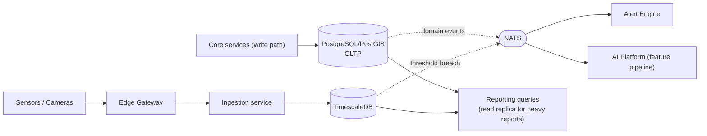
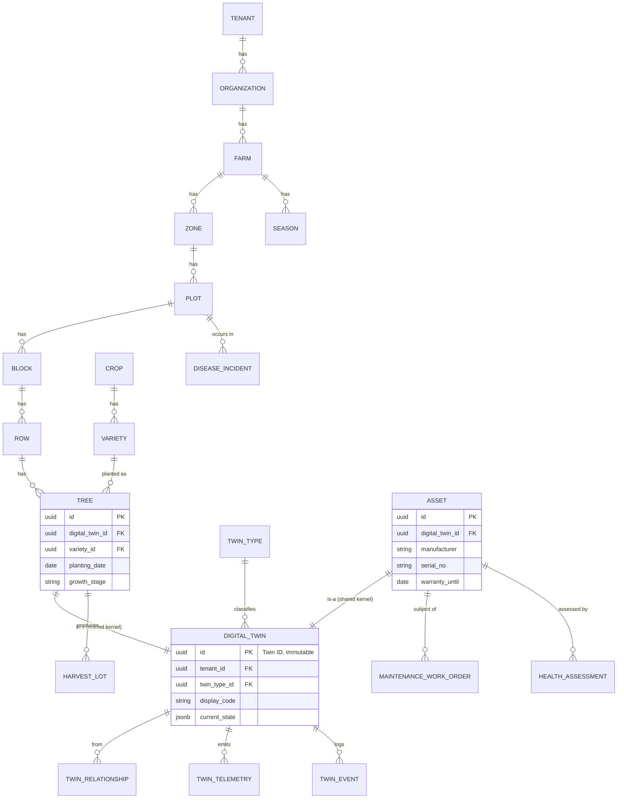

# 08 — Data Architecture (Phase 1)

**Document status:** Draft for internal review · Phase 1 · v0.1
**Related:** [06-ARCHITECTURE.md](06-ARCHITECTURE.md) · [07-DOMAIN-MODEL.md](07-DOMAIN-MODEL.md) · [04-SRS.md §10](04-SRS.md)

This is a **logical** data architecture (store selection, data flow, classification, retention). The full physical ERD/DDL/migrations are a Phase 3 (Platform Foundation) implementation deliverable, produced once the bounded contexts in [07-DOMAIN-MODEL.md](07-DOMAIN-MODEL.md) are reviewed.

---

## 1. Polyglot persistence rationale

| Store | Used for | Why not one database for everything |
|---|---|---|
| **PostgreSQL + PostGIS** | Transactional data for every bounded context (Identity, Farm & Crop, Digital Twin state/relationships, Asset, Inventory, Finance, Workflow) + spatial geometry (farm boundaries, plot polygons, GPS points) | Relational integrity and ACID transactions are required for approvals, financial postings, and twin-graph consistency; PostGIS gives spatial query capability in the same engine as the transactional data it's usually queried alongside (no cross-store join for "assets within this plot") |
| **TimescaleDB** (Postgres extension) | `TwinTelemetry`, sensor readings, health-assessment history | Telemetry is high-volume, append-only, time-ordered, and queried by time-range/aggregation — a plain relational table without hypertable partitioning degrades badly at the target scale (NFR-002: millions of records/day) |
| **Redis** | Session cache, rate-limit counters, short-lived workflow state, live-telemetry pub/sub fan-out to WebSocket clients | Sub-millisecond access for ephemeral state that doesn't need durability guarantees |
| **Object storage (S3-compatible / MinIO)** | IFC models, 3D Tiles/point-cloud assets, uploaded photos (vision AI frames, harvest evidence), documents | Large binary blobs don't belong in the relational database; this repo's existing pattern of storing IFC files on disk under `backend/data/models/` is the direct precursor — Phase 3 replaces the disk path with an object-storage adapter behind the same interface |
| **NATS (event bus)** | Domain events (§4 of [07-DOMAIN-MODEL.md](07-DOMAIN-MODEL.md)) | Decouples producer/consumer contexts; not a system of record — events are notifications, not the durable store of truth (the originating context's Postgres table is) |
| **Vector store** (e.g. pgvector on the same Postgres, to avoid a fifth store unless scale demands otherwise) | RAG retrieval for the AI Copilot (FR-COPILOT-001) | Copilot answers must cite real platform data — pgvector keeps the embedding index close to the source-of-truth tables it indexes, avoiding a separate sync pipeline until proven necessary |

## 2. Data flow (OLTP → analytics/reporting)

Reports (RPT-001) read from a **read replica** of PostgreSQL plus TimescaleDB continuous aggregates, not the primary transactional connection — protects write-path latency (NFR-001) from report-driven load.

## 3. Data classification & retention

| Class | Examples | Retention policy (initial default, tenant-configurable) | Sensitivity |
|---|---|---|---|
| Identity/PII | User names, contact info | Retained for account lifetime + legal minimum after deactivation | High — access-controlled, audit-logged reads |
| Financial | Postings, invoices, budgets | Retained per applicable statutory/tax retention period (jurisdiction-configurable), append-only (FIN-002) | High |
| Audit trail | `AuditEntry` records | Retained indefinitely (append-only, BR-004); never purged by a tenant-level retention policy | High |
| Agronomic/operational | Irrigation/fertigation events, disease incidents, work orders | Retained indefinitely at summary level; raw telemetry rolled up after the raw-retention window below | Medium |
| Telemetry (raw) | Sensor readings | Raw resolution retained 90 days (default), downsampled/aggregated (hourly/daily) retained indefinitely via TimescaleDB continuous aggregates | Low–Medium |
| Vision AI frames | Camera detection source images | Retained 30 days by default (VIS-003, tenant-configurable), confirmed-incident-linked frames retained with the incident indefinitely | Medium (may contain worker imagery — see SEC) |
| AI prediction/feedback | Model outputs, user feedback | Retained indefinitely for model evaluation, linked to model version (AI-005) | Medium |

Raw-telemetry downsampling and vision-frame expiry are implemented as TimescaleDB retention policies / object-storage lifecycle rules respectively — not application-code cron jobs — so they run reliably regardless of application deployment state.

## 4. Standard fields (recap, enforced schema-wide — DATA-001/002)

Every table: `id UUID PRIMARY KEY`, `tenant_id UUID NOT NULL` (FK to `tenants`, indexed, and enforced via row-level security — see [ADR-007](11-ADR.md)), `created_at`, `created_by`, `updated_at`, `updated_by`. Soft-delete (`deleted_at`) only on entities where recoverability is a business requirement (e.g. `Asset`, `Tree` — accidental deletion of a tree twin should be recoverable); hard-delete-with-audit-trail everywhere else (DATA-002).

## 5. Conceptual ERD — core cross-context entities

This is deliberately conceptual (no full column lists, no physical types beyond illustrative examples) — the physical schema, indexes, and constraints are produced in Phase 3 as `07-DATABASE.md`/`08-ERD.md` once the bounded contexts above are confirmed, per the platform brief's documentation structure (§49).

## 6. Migration to this model from the current codebase

The current `equipment` table ([00-EXISTING-CODEBASE-ANALYSIS.md §1.2](00-EXISTING-CODEBASE-ANALYSIS.md)) becomes the seed data for `digital_twin` + `asset` (TwinType = `asset:<subtype>`) and, for `tree_*`-prefixed rows, `digital_twin` + `tree` (TwinType = `tree:<species>`). This is a **Phase 3/6 data migration task**, not a Phase 1 concern, but is recorded here so the target shape is unambiguous when that migration is written.
