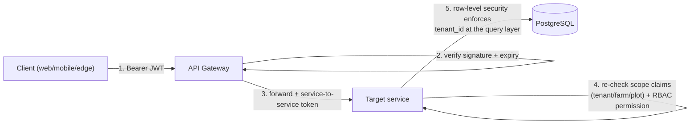
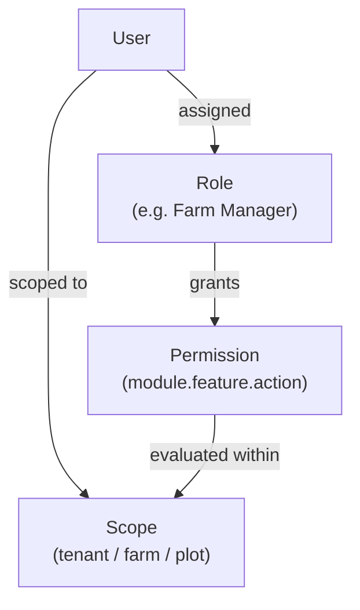
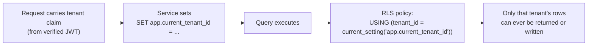
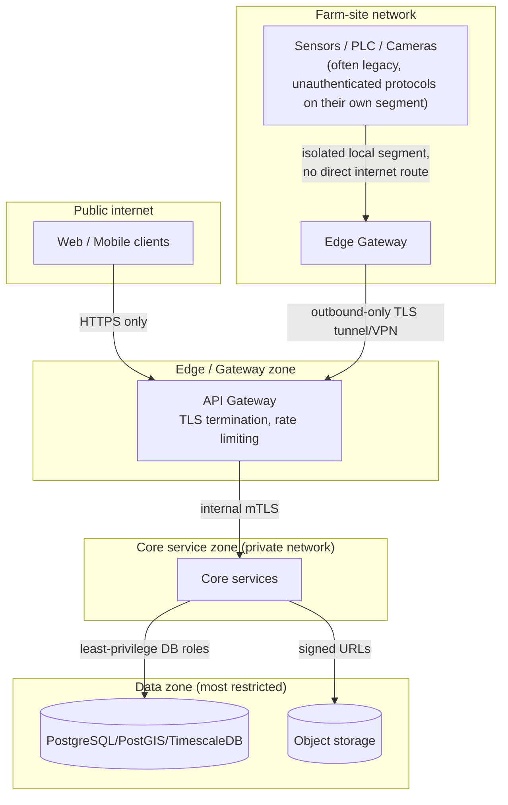
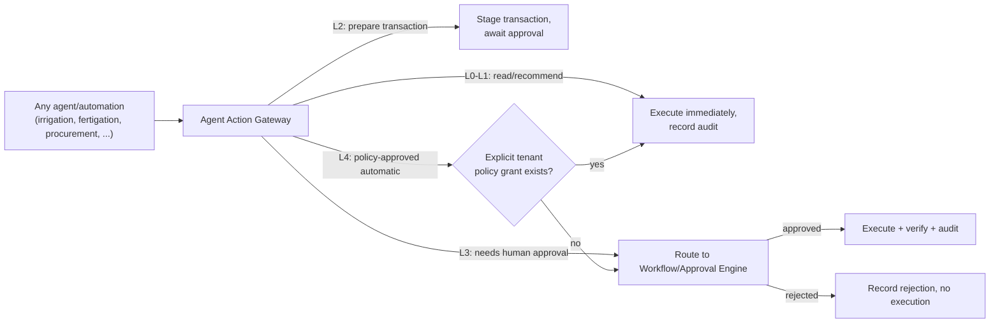

# 09 — Security Architecture (Phase 1)

**Document status:** Draft for internal review · Phase 1 · v0.1
**Related:** [06-ARCHITECTURE.md](06-ARCHITECTURE.md) · [04-SRS.md §7](04-SRS.md) · [11-ADR.md](11-ADR.md)

---

## 1. Zero Trust posture

No request is trusted by network origin. Every request — from the web app, mobile PWA, edge gateway, or another internal service — is authenticated and authorized at the API Gateway **and again** at the receiving service (defense in depth; the gateway check is a fast-fail, not the sole check per SEC-002).

## 2. Identity & authentication

- **Protocol:** OAuth2/OIDC. The platform runs (or federates to) an OIDC provider issuing short-lived access tokens (JWT) + refresh tokens.
- **MFA-ready:** the identity provider supports TOTP/WebAuthn from Phase 3, even if not enforced for every tenant at launch (SEC-001).
- **Device identity is separate from user identity:** IoT devices authenticate via per-device X.509 client certificates (mTLS) to the MQTT broker, or a device-scoped API key for HTTP-based devices — never a shared/global device credential (SEC-006).
- **Password storage** (for any local-credential fallback): Argon2id.

## 3. Authorization model — RBAC + ABAC

- **Permission shape:** `module → feature → action → scope` (FR-PLT-004), e.g. `irrigation.plan.approve@farm:FARM01`.
- **Actions:** View, Create, Update, Delete, Approve, Export, Execute, Configure (per the platform brief §34).
- **Sensitive actions require elevated scope, not just role:** e.g. `finance.posting.create` requires both the Finance role *and* explicit scope on the target farm/cost-center — a Finance user at Farm A cannot post against Farm B without an explicit cross-farm grant.
- **Enforcement point:** a shared authorization middleware/library used by every service (not reimplemented per service) — this is itself a Phase-3 platform-foundation deliverable, referenced by every later phase rather than rebuilt.

## 4. Multi-tenant isolation

Decision: **row-level security (RLS)** in PostgreSQL keyed on `tenant_id`, with the application connection setting a session variable (`app.current_tenant_id`) per request — see [ADR-007](11-ADR.md) for the alternatives considered and why schema-per-tenant/database-per-tenant were rejected for v1.

This makes tenant isolation a **database-enforced guarantee**, not an application-code discipline — a missing `WHERE tenant_id = ?` in a future query cannot leak cross-tenant data (directly satisfies SEC-003 and BR-007, and closes Risk R-06 from [05-RTM.md](05-RTM.md) at the architecture level).

## 5. Network & edge security zones

Legacy field devices (PLC, some sensors) frequently cannot do TLS/authentication themselves — they sit on an isolated local network segment behind the Edge Gateway, which is the actual authenticated party to the cloud/core platform. The Edge Gateway is the trust boundary, not the individual device.

## 6. AI governance enforcement point

Per BR-002/BR-003/AI-004, agent action-level enforcement (L0–L4) is implemented as a **single shared gateway** every agent/recommendation-execution path calls through — not a check duplicated per agent:

High-risk categories (pesticide/chemical application, pump activation beyond safe threshold, procurement, financial posting, deletion, device configuration) are **hardcoded at L3 minimum in the gateway itself** — no per-tenant policy can downgrade them below human approval; only a platform-level policy change (requiring its own approval/audit trail) could ever alter that floor.

## 7. Audit trail architecture

The Identity & Tenant Service exposes an internal `AuditWriter` interface; every command handler in every service calls it synchronously in the same transaction as the state change it's auditing (not fire-and-forget/best-effort) so an audit record is never lost due to a downstream failure. Audit records are themselves subject to RLS (tenant-scoped) but are never subject to any tenant-configurable retention/deletion policy (§3 of [08-DATA-ARCHITECTURE.md](08-DATA-ARCHITECTURE.md)).

## 8. Secrets & encryption

- Secrets (DB credentials, JWT signing keys, LLM/weather API keys) are sourced from a secret manager (cloud-native KMS/secret store, or a self-hosted equivalent like Vault/SOPS for on-prem) — never from `.env` files committed to source control (SEC-004). **This repo's current `backend/.env`-based config pattern is fine for local dev; production deployment must replace the `.env` file source with a secret-manager-backed source before go-live.**
- TLS everywhere in transit (client↔gateway, gateway↔service internal mTLS, edge↔core).
- Encryption at rest via the managed database/object-storage provider's native encryption where cloud-hosted; disk-level encryption (LUKS or equivalent) where on-prem (SEC-008).

## 9. File upload security

IFC models, images, and documents are validated by content-type/magic-bytes (not just file extension — closes a gap in this repo's current `.ifc`-extension-only check), size-limited, virus-scanned where the deployment tier supports it, stored under randomized object keys outside any web-servable path, and served only via short-lived signed URLs (SEC-005).
