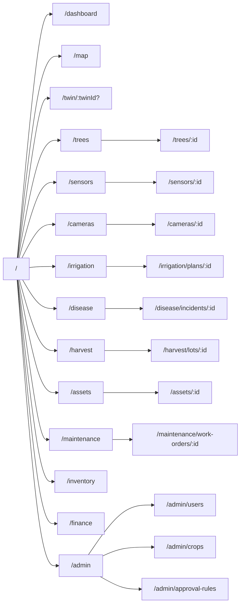
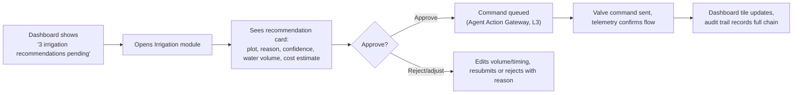
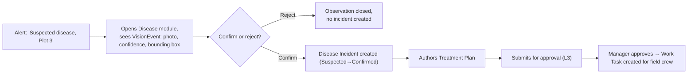
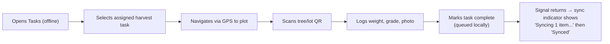
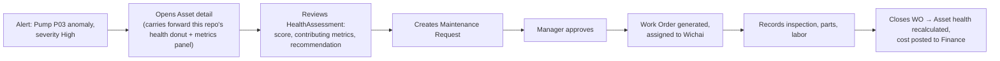

# 12 — UX/UI & Design System (Phase 2)

**Document status:** Draft for internal review · Phase 2 · v0.1
**Related:** [01-VISION.md §4](01-VISION.md) (personas) · [02-SCOPE.md](02-SCOPE.md) · [03-BRD.md](03-BRD.md) · [06-ARCHITECTURE.md](06-ARCHITECTURE.md) · [04-SRS.md §11.4](04-SRS.md) (NFR-007/008)

No page in this document ships with placeholder/dummy data behind it — every wireframe below is annotated with the API it reads from (per [10-INTEGRATION-ARCHITECTURE.md](10-INTEGRATION-ARCHITECTURE.md)) so Phase 3+ implementation never has an excuse to fake a chart.

---

## 1. Design system foundations

### 1.1 Tokens

This repo's existing dark theme ([src/style.css](../src/style.css)) is the validated starting palette — carried forward, not replaced, and extended with the semantic tokens the wider platform needs (status bands, light-mode variant for office/desk use where dark isn't preferred).

| Token | Value | Source |
|---|---|---|
| `--bg` | `#1e2127` | existing |
| `--bg-alt` | `#262a33` | existing |
| `--panel` | `#22252c` | existing |
| `--border` | `#363b46` | existing |
| `--text` | `#e6e8eb` | existing |
| `--text-dim` | `#9aa0ac` | existing |
| `--accent` | `#4f8cff` | existing |
| `--accent-dim` | `#35507f` | existing |
| `--danger` | `#ff5f5f` | existing |
| `--status-good` | `#4ade80` | existing (health dashboard band color) |
| `--status-warning` | `#facc15` | existing (health dashboard band color) |
| `--status-critical` | `#f87171` | existing (health dashboard band color) |
| `--status-offline` | `#6b7280` | new — needed for IoT/device offline state, absent from today's equipment-only palette |
| `--status-maintenance` | `#a78bfa` | new — distinct from critical, needed once real maintenance work orders exist |

Light-mode token set (for Finance/Admin desk users who may prefer it) is a direct light-value mapping of the same semantic names — not designed here in full, flagged as a Phase 2 implementation task once the component library is stood up in Next.js/Tailwind.

**Typography:** `Segoe UI, system-ui, -apple-system, sans-serif` (existing) for Latin script; a Thai-inclusive fallback (e.g. `'Noto Sans Thai', 'Segoe UI', ...`) must be added to the stack before Thai-language UI (NFR-007) ships — **this repo's current font stack has no Thai-script fallback today**, a concrete gap despite the existing Thai strings in `health.py`/`main.js` rendering acceptably via OS font substitution; it should not be left to chance in production.

**Spacing/type scale:** adopt Tailwind's default scale (4px base unit) when the frontend migrates per [ADR-012](11-ADR.md), rather than inventing a new scale — the existing CSS's ad hoc px values (14px, 8px, 16px...) map cleanly onto it.

### 1.2 Status/band convention

Every health-, alert-, or condition-bearing entity in the platform (asset, tree, sensor, work order, disease incident) renders through the **same** five-state visual language — this repo's equipment dashboard already established the pattern (`band-good/warning/critical`); it now extends platform-wide:

| State | Color token | Meaning |
|---|---|---|
| Good/Normal | `--status-good` | within normal operating parameters |
| Warning | `--status-warning` | attention needed, not urgent |
| Critical | `--status-critical` | urgent, act now |
| Offline | `--status-offline` | no recent data — distinct from "known good," never conflated with it |
| Maintenance | `--status-maintenance` | intentionally out of service |

## 2. Navigation shell

```mermaid
flowchart TB
    subgraph TopBar["Top Bar (persistent)"]
        Brand["Brand"] --- FarmSel["Farm/Org selector"] --- SeasonSel["Season/date selector"] --- Search["Global search"] --- Notif["Notification center"] --- Lang["EN/TH toggle"] --- Copilot["AI Copilot toggle"] --- User["User menu"]
    end
    subgraph LeftNav["Left Nav (collapsible)"]
        direction TB
        N1["Dashboard"]
        N2["Farm Map"]
        N3["3D Twin"]
        N4["Trees"]
        N5["Sensors"]
        N6["Cameras"]
        N7["Irrigation"]
        N8["Disease"]
        N9["Harvest"]
        N10["Assets"]
        N11["Maintenance"]
        N12["Inventory"]
        N13["Finance"]
        N14["Admin"]
    end
    Breadcrumb["Breadcrumb (per page, below top bar)"]
    CopilotPanel["AI Copilot side panel (slide-in, non-modal — stays open while user works)"]
```

Left-nav items are **RBAC-filtered per role** (FR-PLT-003) — e.g. a Field Worker persona (Ban) never sees Finance/Admin in the nav at all, not merely a disabled link (a disabled-but-visible link for a module the user can never use is itself an information leak about the platform's structure and adds noise for no benefit).

## 3. Sitemap

Mobile PWA has a **reduced sitemap** (Tasks, Scan, Harvest, Maintenance-log, Sync status only) — it is not a responsive shrink of every desktop page; it is a purpose-built task-execution surface (FR-MOB-001), detailed in §6.15.

## 4. Core UI component inventory

| Component | Carried forward from this repo | New in target platform |
|---|---|---|
| Top bar / toolbar | ✅ `#topbar` pattern | + farm/season selector, global search, language toggle |
| Tab panel | ✅ `.tab-btn`/`.tab-content` pattern | reused for all multi-section detail pages |
| Side panel (collapsible) | ✅ tree/props panel pattern | reused for map layer manager, AI copilot |
| Property/form row (`prop-row`, `prop-key`, `prop-val`) | ✅ | reused across every entity detail page — one form-row component, not reinvented per module |
| Health donut chart | ✅ `makeDonutChart` | generalized to any 0–100 score (trees, disease risk, not just equipment) |
| Fleet dashboard (stat tiles + distribution bar + sortable table) | ✅ | generalized into the configurable widget system (FR-DASH-001/002) |
| Drag-and-drop placement + click-to-arm | ✅ equipment/tree placement | reused for camera/sensor placement on the map and 3D twin |
| Spatial tree (IFC structure) | ✅ | reused pattern for Farm→Zone→Plot→Tree navigation tree |
| Modal-free property inspector on click-select | ✅ | reused as the twin inspector across map/3D/list views |
| Data table with sort + row action | ✅ (dashboard table) | generalized as a shared `DataTable` component (pagination, filter, export) |
| Notification center | — | new |
| Global search | — | new |
| AI Copilot panel | — | new (chat-style, non-modal, cites source data per FR-COPILOT-001) |
| Approval action bar (Approve/Reject/Return, with reason) | — | new, reused across every workflow-gated entity (FR-PLT-005) |
| Map layer manager | — | new |
| Configurable dashboard widget grid | — | new (extends the existing fixed dashboard) |
| Offline/sync status indicator | — | new (mobile PWA, FR-MOB-002) |

## 5. Key user journeys

### 5.1 Nok (Farm Manager) — reviews and approves an AI irrigation recommendation

Maps to FR-IRR-003, FR-IRR-004, [09-SECURITY-ARCHITECTURE.md §6](09-SECURITY-ARCHITECTURE.md), and the platform brief's §55 end-to-end scenario.

### 5.2 Dr. Preecha (Agronomist) — reviews a Vision AI disease detection

Maps to FR-CCTV-004/005, FR-HEALTH-001/003, VIS-002.

### 5.3 Ban (Field Worker, mobile, offline) — completes a harvest task

Maps to FR-WORK-003, FR-MOB-001/002, [ADR-013](11-ADR.md).

### 5.4 Wichai (Maintenance Engineer) — acts on a predictive-maintenance alert

Maps to FR-PDM-001/002, FR-MNT-002, the platform brief's §57 scenario.

## 6. Page-by-page wireframe specifications

Each page below: **Purpose**, **Region layout**, **Primary data source (API)**, **Key states**, **Requirement refs**.

### 6.1 Dashboard (Executive Command Center)

| Region | Content |
|---|---|
| Header | Farm health score (large), season summary, last-updated timestamp |
| Widget grid (drag-and-drop, saved per user) | Map preview tile, 3D twin preview tile, weather, soil moisture summary, disease risk, irrigation status, yield forecast (with confidence range), harvest forecast, equipment health (**this repo's existing dashboard is the seed widget**), work orders due, inventory alerts, financial KPIs, top AI recommendations |
| Source | `/api/v1/dashboard/summary` (aggregation endpoint, composed server-side from each module's own summary, not client-side fan-out to 12 endpoints) |
| States | Empty (new tenant, no farms yet) → onboarding CTA; stale-data banner if any widget's source hasn't updated within its expected interval |
| Refs | FR-DASH-001/002/003 |

### 6.2 Farm Map (GIS)

| Region | Content |
|---|---|
| Left | Layer manager (boundary, plots, rows, infrastructure, sensors, cameras, health overlay, disease overlay) |
| Center | MapLibre GL canvas; draw/edit tools; measure tools |
| Right (on selection) | Selected feature property panel (**reuses this repo's property-panel component**) |
| Source | `/api/v1/gis/layers`, `/api/v1/farms/:id/plots` |
| States | Loading (skeleton map), empty (no boundary drawn yet → draw-boundary CTA), offline (cached last-known tiles, banner) |
| Refs | FR-GIS-001..007 |

### 6.3 3D Twin

| Region | Content |
|---|---|
| Left (collapsible) | Spatial tree (**this repo's existing collapsible tree, extended from IFC-only to the full Farm→Zone→Plot→Tree hierarchy**) |
| Center | 3D viewport — hybrid IFC + 3D Tiles scene per [ADR-005](11-ADR.md)/[ADR-006](11-ADR.md); View/Edit mode toggle (**existing**); layer toggles (health/disease/soil/irrigation/equipment/CCTV/yield/cost — FR-TWIN-003) as an overlay bar |
| Right (collapsible, on selection) | Twin inspector: properties, live telemetry, alarm state, historical trend, linked CCTV thumbnail, linked work orders, AI recommendations (**existing property panel + health section, generalized to any twin type**) |
| Toolbar | Open model, fit-to-view, mode toggle, save-to-server (**all existing**) |
| Source | `/api/v1/twins/:id`, `/api/v1/twins/:id/telemetry`, WebSocket for live push |
| States | Loading (existing loading overlay + progress %), model-load-failure (existing alert pattern, upgraded to inline banner), empty (no model loaded → existing drop-zone) |
| Refs | FR-TWIN-001..005, TWIN-001..005 |

### 6.4 Trees

| Region | Content |
|---|---|
| List view | Filterable/sortable table: Twin ID, species/variety, plot, growth stage, health score, last harvest | reuses `DataTable` |
| Detail view | Header (species, variety, planting date, age), tabs: Overview / Health / Irrigation history / Fertilization history / Disease history / Harvest history / Photos |
| Source | `/api/v1/trees`, `/api/v1/trees/:id` |
| States | Bulk-import in progress (progress indicator, per FR-FARM-006) |
| Refs | FR-FARM-005/006/007 |

### 6.5 Sensors

| Region | Content |
|---|---|
| List view | Device table: type, location, last reading, battery/signal, status (good/warning/critical/**offline**) |
| Detail view | Live reading chart (time-range selector), calibration history, linked twin/plot, alert history |
| Source | `/api/v1/sensors`, `/api/v1/telemetry?device_id=...`, WebSocket for live |
| States | **Offline** is a first-class visual state (distinct gray, per §1.2), not just a missing chart |
| Refs | FR-IOT-001..006, IOT-001..005 |

### 6.6 Cameras

| Region | Content |
|---|---|
| Grid view | Camera thumbnails with live/last-frame preview, status |
| Detail view | Live stream (or last snapshot if stream unavailable), recent VisionEvents list (thumbnail + confidence + confirm/reject buttons — the human-review workflow surfaced directly here) |
| Source | `/api/v1/cameras`, `/api/v1/vision-events?camera_id=...` |
| Refs | FR-CCTV-001..005, VIS-001..003 |

### 6.7 Irrigation

| Region | Content |
|---|---|
| Left | Water network diagram (source→pump→pipe→zone→valve), status color-coded |
| Center | Recommendation queue (card list per §5.1) + active/scheduled irrigation events |
| Detail | Plan detail: crop/growth-stage inputs, soil moisture trend, recommended volume, approval action bar |
| Source | `/api/v1/irrigation/plans`, `/api/v1/irrigation/network` |
| Refs | FR-IRR-001..004 |

### 6.8 Disease

| Region | Content |
|---|---|
| List view | Incident board by lifecycle stage (Detected→...→Resolved), Kanban-style columns |
| Detail | Evidence (photos, confidence), risk-engine inputs, Treatment Plan, approval action bar, follow-up inspection log |
| Source | `/api/v1/diseases/incidents` |
| Refs | FR-HEALTH-001..004 |

### 6.9 Harvest

| Region | Content |
|---|---|
| Planning view | Harvest calendar against yield-forecast confidence range |
| Execution view | Batch/Lot list, QR generation, grade breakdown |
| Traceability view | QR lookup → Lot → Plot → Tree → Farm chain (read-only, exportable) |
| Source | `/api/v1/harvest/lots`, `/api/v1/yield/forecast` |
| Refs | FR-YIELD-001/002, FR-HARV-001/002 |

### 6.10 Assets

| Region | Content |
|---|---|
| List view | Asset table with health band (**directly generalizes this repo's existing equipment dashboard table**) |
| Detail view | Header (manufacturer/serial/warranty), health donut + metrics (**existing**), position/twin binding, maintenance history, documents |
| Source | `/api/v1/assets`, `/api/v1/assets/:id/health` |
| Refs | FR-ASSET-001/002 |

### 6.11 Maintenance

| Region | Content |
|---|---|
| Board view | Work orders by status (Requested/Approved/In Progress/Closed) |
| Detail | Linked asset, inspection notes, parts consumed, labor hours, approval action bar |
| Source | `/api/v1/work-orders` |
| Refs | FR-MNT-001/002, FR-PDM-001/002 |

### 6.12 Inventory

| Region | Content |
|---|---|
| List view | Stock by warehouse/bin, reorder-point flags |
| Detail | Item movement history (receipt/issue/transfer/adjustment), linked work orders |
| Source | `/api/v1/inventory/items` |
| Refs | FR-INV-001/002, FR-PROC-001 |

### 6.13 Finance

| Region | Content |
|---|---|
| Overview | Budget vs actual by farm/plot, profit heatmap over the spatial hierarchy (**visual pattern reuses the map's health-overlay coloring convention**) |
| Detail | Posting list by dimension, drill-down to source transaction (work order, harvest lot, purchase) |
| Source | `/api/v1/finance/postings`, `/api/v1/finance/profitability` |
| Refs | FR-ACC-001/002, FR-PROF-001/002 |

### 6.14 Admin

| Region | Content |
|---|---|
| Users & Roles | User list, role assignment, scope (tenant/farm/plot) grants |
| Crop & Variety Master | Configuration editor (versioned) — this is the UI for FR-FARM-003's "no code change to add crop #8" guarantee |
| Approval Rules | Threshold/condition editor for the workflow engine |
| Audit Log | Searchable, read-only, filterable by actor/entity/date |
| Source | `/api/v1/admin/*` |
| Refs | FR-PLT-001..010, SEC-002/003 |

### 6.15 Mobile PWA (reduced sitemap, distinct design, not a responsive shrink)

| Screen | Content |
|---|---|
| Task list | Today's assigned tasks, offline-available |
| Task detail | Navigate/scan/photo/measurement capture |
| Harvest capture | QR scan → weight/grade entry |
| Sync status | Queue depth, last sync time, manual retry |
| Refs | FR-MOB-001/002, [ADR-013](11-ADR.md) |

## 7. Responsive behavior

| Breakpoint | Target | Key layout changes |
|---|---|---|
| < 640px | Mobile PWA only (reduced sitemap, §6.15) | Desktop pages (Map, 3D Twin, Finance, Admin) are **not** responsively squeezed onto this width — they are out of scope for phone use per the platform brief's mobile-first-for-*field-work* (not mobile-first-for-*everything*) intent; a phone visiting a desktop-only route is redirected to a "use a tablet or desktop for this view" notice, not given a broken cramped layout |
| 640–1024px (tablet) | Field Supervisor tablet use | Left nav collapses to icon-only; side panels (property inspector, layer manager) become bottom sheets rather than fixed side columns; 3D viewport and Map remain full-featured (a Supervisor does use these on a tablet in the field) |
| 1024–1440px (small desktop) | Standard office use | Full layout as wireframed in §6, side panels default to collapsed to maximize center content, matching this repo's existing collapsible-panel pattern |
| > 1440px (large desktop) | Command Center / multi-monitor | Dashboard widget grid expands column count; 3D Twin can show inspector panel permanently expanded alongside the viewport |

## 8. UI states (applies to every data-bound view, NFR-008)

| State | Pattern |
|---|---|
| Loading | Skeleton placeholders matching the eventual layout (not a generic spinner over blank space) — extends this repo's existing `loading-text` + percentage pattern used for IFC model loads |
| Empty | Explicit message + relevant call-to-action (e.g. "No trees planted yet — Import from CSV or place on the map") |
| Error | Inline banner with retry action, never a silent console-only failure — extends this repo's existing `alert()`-on-failure pattern, upgraded to non-blocking inline banners |
| Permission denied | Explicit "You don't have access to X in this farm" message, never a blank/broken page or a misleading 404 |
| Offline | Persistent, unmissable banner (not just an icon) stating what's stale and what still works — **this repo's existing backend-unavailable fallback messaging in Thai is the validated pattern to generalize** |
| Stale data | Timestamp shown on every live-data widget ("as of 14:32"); visually flagged if beyond the expected refresh interval |

## 9. Accessibility & localization

- Thai/English toggle is a top-bar control (§2), persisted per user, not per browser session only.
- All interactive elements reachable by keyboard; the existing property-form inputs (`eq-input` pattern) already use native `<input>`/`<select>`/`<textarea>` elements, which is the right accessible foundation to keep during the React migration rather than replacing with custom-styled non-native controls.
- Color is never the sole signal for status — every status band pairs a color with a text label/icon (already true of this repo's `band-*` badges; must remain true as the pattern generalizes to sensors/disease/maintenance).
- Minimum touch target size 44×44px on mobile/tablet touch surfaces (field-worker PWA is used outdoors, often with gloves or wet hands — generous targets are a usability requirement, not a nicety).
